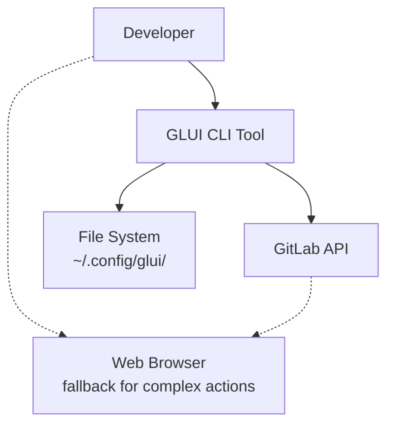
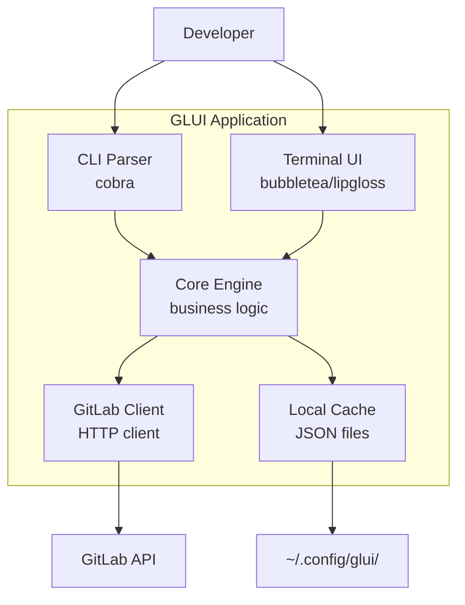
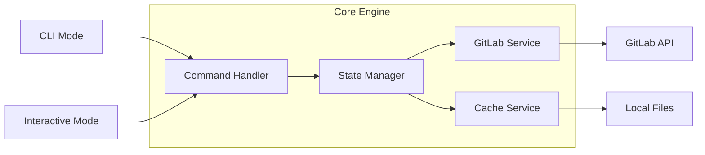
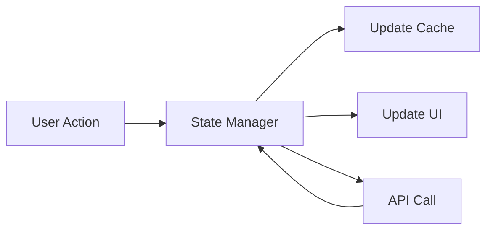
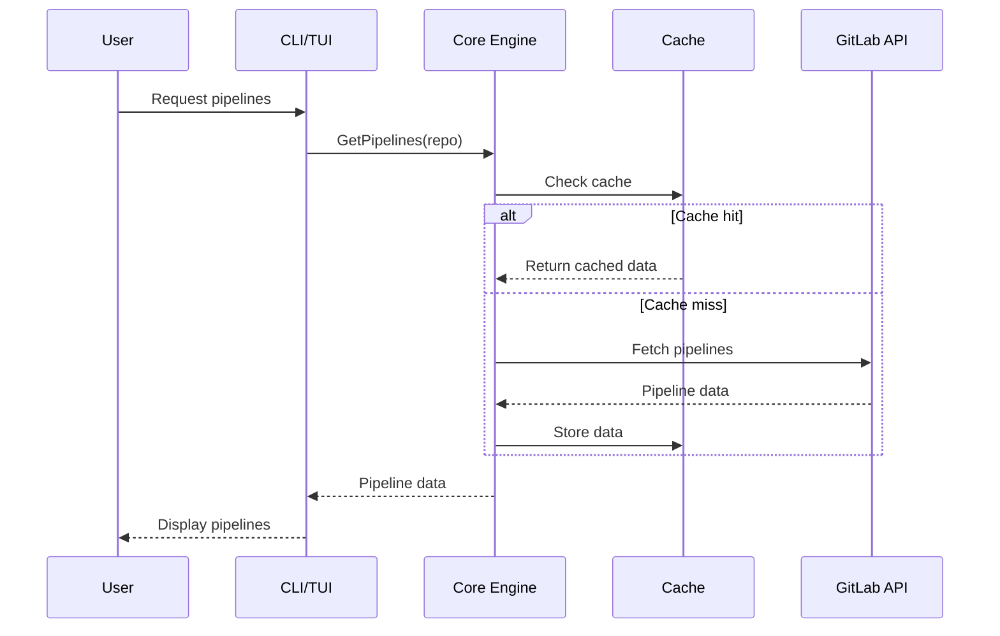

# GLUI Architecture (C4 Model)

## Context Diagram



## Container Diagram



## Component Diagram - Core Engine



## Design Decisions

### 1. Dual Interface Pattern
**Decision**: Single core with two interfaces (CLI + TUI)

```go
// Shared core interface
type Core interface {
    GetPipelines(repo string) ([]Pipeline, error)
    GetMergeRequests(repo string) ([]MR, error)
    CreatePipeline(repo, branch string, vars map[string]string) error
}

// CLI usage
glui pipelines my-repo

// TUI usage  
glui (interactive mode)
```

**Benefits**:
- Code reuse between modes
- Consistent behavior
- Easy testing with mocks

### 2. State Management
**Decision**: Centralized state with event-driven updates



### 3. Caching Strategy
**Decision**: Write-through cache with TTL

- **Pipelines**: 30s TTL (status changes frequently)
- **MRs**: 2min TTL (less frequent updates)  
- **Projects**: 1hr TTL (rarely change)
- **User data**: Session-based

### 4. Error Handling
**Decision**: Layered error handling

```go
// API layer - wrap with context
func (g *GitLabClient) GetPipelines(repo string) error {
    if err := g.api.Get(); err != nil {
        return fmt.Errorf("gitlab api: %w", err)
    }
}

// Core layer - add business context  
func (c *Core) GetPipelines(repo string) error {
    if err := c.gitlab.GetPipelines(repo); err != nil {
        return fmt.Errorf("failed to load pipelines for %s: %w", repo, err)
    }
}
```

## Technology Stack

| Layer | Technology | Reason |
|-------|------------|---------|
| CLI | cobra | Standard Go CLI framework |
| TUI | bubbletea + lipgloss | Modern, composable TUI |
| HTTP | net/http + retries | Simple, reliable |
| Config | viper | Standard config management |
| Cache | JSON files | Simple, human-readable |
| Testing | testify + httptest | Standard Go testing |

## File Structure

```
glui/
├── cmd/           # CLI commands (cobra)
├── internal/
│   ├── core/      # Business logic
│   ├── gitlab/    # GitLab API client
│   ├── tui/       # Terminal UI components
│   ├── cache/     # Caching layer
│   └── config/    # Configuration
├── docs/          # Documentation
└── test/          # Integration tests
```

## Data Flow



## Scalability Considerations

- **Concurrent API calls**: Use worker pools for batch operations
- **Memory usage**: Stream large responses, limit cache size
- **Rate limiting**: Respect GitLab API limits (300 req/min)
- **Config**: Support multiple GitLab instances (cloud + on-prem)
